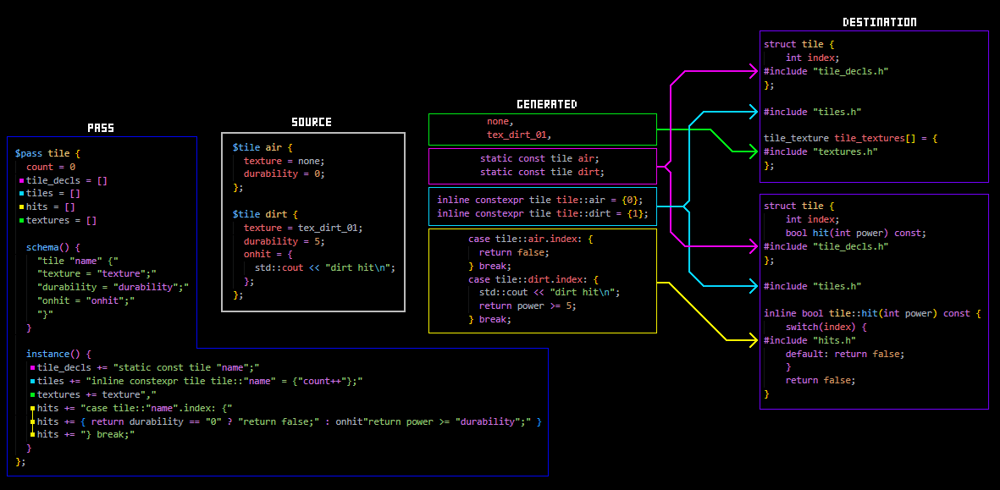

vast majority of this project is written by AI,
but i think it can do the one thing its meant to do pretty well


# Content Builder - CMake Example

This example demonstrates the usage of the code generation system.

The generator emits one shared build tree:
- generated fragments go under a shared `g/` folder
- stripped shared sources are emitted once into the generated root by default
- consumers include only the generated fragments and stripped shared files they need

Pass authoring notes:
- fragment outputs are inferred from `name += ...` lines in the instance block
- you no longer need `my_fragment = []` declarations in the pass preamble
- `index` is a built-in per-instance counter starting at `0`
- branch choices can be captured with syntax like `side["server"|"client"]`



## Usage
Navigate to `examples/cmake-example/` and run the scripts using a bash-compatible shell (like Git Bash on Windows, or the terminal on Linux/macOS):

```bash
./build.sh
./run.sh
```
