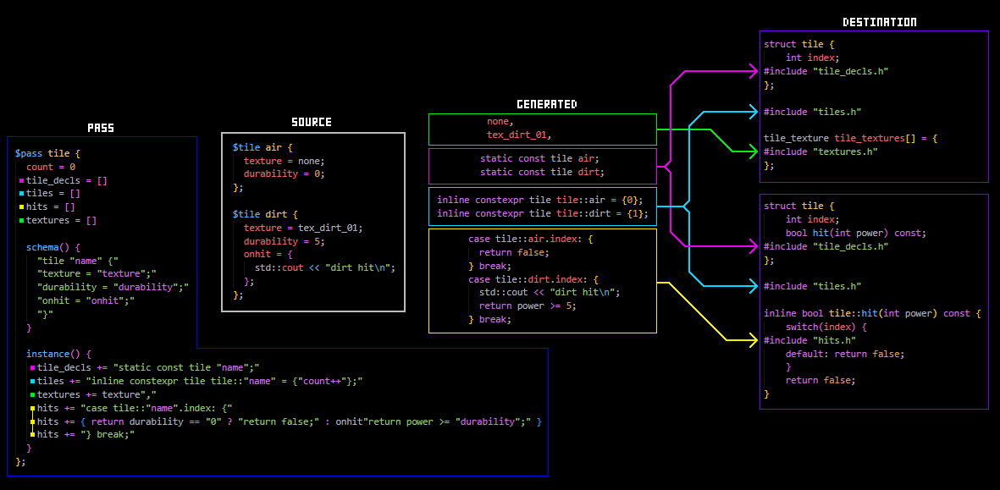

this project is written by AI,
but i think it can do the one thing its meant to do pretty well

i am no longer using this. it is really good at defining a lot of simple passes. but when it comes to more complex ones, it is pretty much unusable, and i ended up using lots of python anyways. i also ended up making a lot of useless passes which didnt really need to be their own pass. i started adding useless passes for stuff like item, tile, input, mesh, message and a lot more. those were somewhat simple. but that also means they weren't needed at all. then i had some more complex passes for things like shader (which converts the inline code into shader code such as GLSL or WGSL), component, system, observer (generally ECS stuff) which needed more precise control and usually ended up using python functions.

potential future version: i think the simple ones can be converted to one sort of SOA pass, which would be defined identically as a struct, with an exception of a "switch" type, which would just generate a case for each instance. and since its SOA, each variable defined in this fake struct will be stored independently in an array. this would be useful for stuff with different kinds such as lots of items or tiles.
i dont think i will need this though, because i added basic component inheritance to the ECS layer i am making. it makes it possible for components to be forced to create other components and also that they are forced to have certain observers, which is identical to override functions from OOP. this can easily replace the both the passes and the SOA feature.

